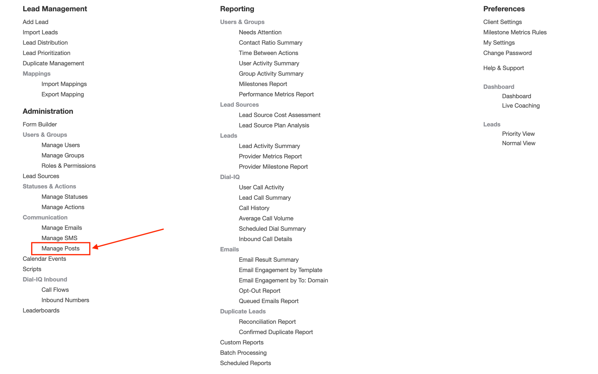

# Velocify Integration Setup

This guide explains how to set up the integration on the Velocify side so that your leads are sent directly to our system.

## Sending Leads to Kastle

In Lead Manager, open the Menu, then under Administration find the option named Manage Posts under Communication. On the next page, select Add New Post.



Fill out the following fields:

- Title - This can be anything, (eg: "Leads to Kastle")
- URL - Webhook URL provided by Kastle. For Angel Oak, this is `https://api.kastle.ai/leads/velocify/receive/angel-oak`
- Type - Must be JSON POST
- Header - This needs to have an Authorization header with the value `Bearer <your-api-key>`. This is as provided in [Introduction](/api-reference/introduction)
- Success Regex - Not used by Kastle
- Body - More info below


The Body must be in JSON format. The Body values for each key in the Body should be made from Velocify Field Tags (Merge Fields).
A list of available Field Tags can be found in the top right hand corner of the New Post area, right under 'Return to Manage Posts'.

Here is a sample of JSON format that includes Field Tags.

```json
{
    "channelWebsite": "{Lead.LeadSource}",
    "firstName": "{First Name}",
    "lastName": "{Last Name}",
    "email": "{Email}",
    "eveningNumber": "{dropchar({Home Phone}|( )-)}",
    "dayNumber": "{dropchar({Day Phone}|( )-)}",
    "cellNumber": "{dropchar({Mobile Phone}|( )-)}",
    "postalCode": "{Property Zip Code}",
    "street": "{Property Street}",
    "state": "{Property State}",
    "city": "{Property City}",
    "leadComment": "",
    "originalLeadId": "{Lead.Id}",
    "Leadtype": "{Lead.LeadType}",
    "LoanPurpose": "{Loan Purpose}",
    "customFields": {}
}
```


Finally, click on Delivery/Drip Settings tab at the top of the New Post area. This section will allow you to set up the conditions
that must be met before Velocify will forward the lead information to Kastle. In most cases the trigger will be the New status and
set to Send Immediately. If you have routing rules in your Velocify, it is advised that you add a 3-5 minute delay as the assigned
user information does not get created with the lead immediately, but is added after a few moments.

## Receiving Status Updates from Kastle

Kastle can send status updates to Velocify. These need to map to one of the organization's
StatusIds or ActionIds as defined on Velocify.

Kastle can send back the following statuses for every lead:

- Qualified (this is the status for when a lead is qualified)
- Unqualified (this is the status for when a lead is disqualified)
- Opt Out (this is the status for when a lead has opted out of receiving further communication)
- No Reply (this is the status for when a lead has not responded to the communication after all attempts have been made)
