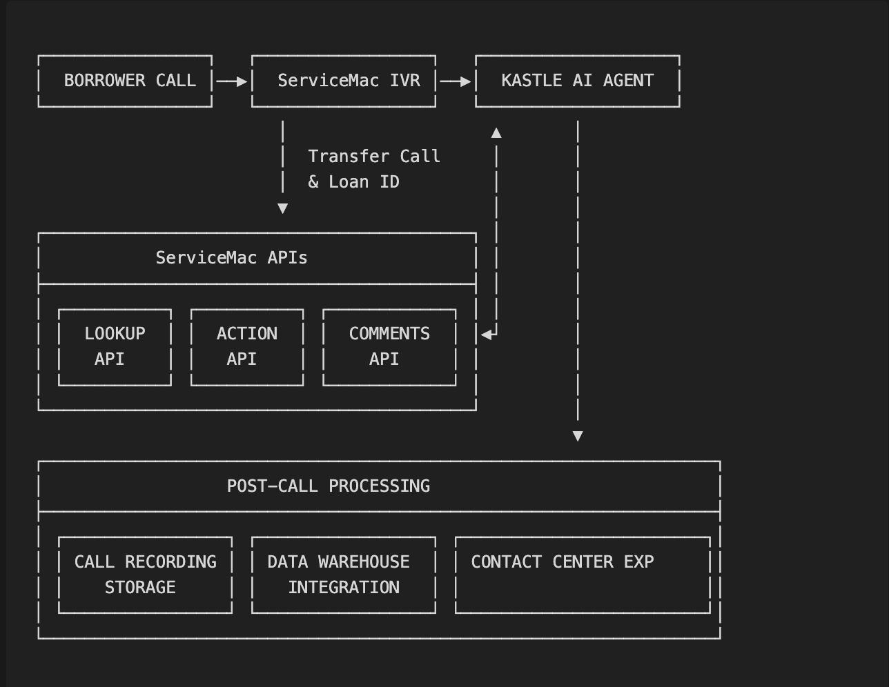

## Executive Summary

This document outlines a comprehensive implementation plan for deploying Kastle AI voice agents at ServiceMac. The implementation will begin with two primary agents:

1. **AI Payment Agent**: Handles inbound payment-related calls, allowing borrowers to make various types of payments.
2. **AI Servicing Transfer Agent**: Addresses borrower questions related to servicing transfers.

The plan details the technical requirements, implementation timeline, resource requirements, and project phases to ensure a go live date of June 1st 2025.

## Project Scope

### Phase 1 (June 2025 Launch)

- AI Payment Agent implementation
- AI Servicing Transfer Agent implementation
- Integration with ServiceMac's existing systems
- Testing and deployment

### Phase 2 (July-September 2025)

- Outbound Welcome and Collections Agent Implementation
- AI Escrow Agent implementation
- Email Agent implementation

### Phase 3 (October-December 2025)

- Call QA and Compliance Agent Implementation (Will be covered in a seperate document)

## Key Stakeholders and Resource Requirements

| Role | Department | Commitment | Responsibilities |
| --- | --- | --- | --- |
| Project Manager | Operations | Full-time | Overall project coordination, timeline management, knowledge base creation |
| Data Engineer | IT/Data Team | 50% time | Database access, data mapping, schema design |
| API Developer | IT/Web Services | 50% time | API development, testing, documentation |
| IVR/Telecom Specialist | Contact Center | 20% time | Call flow design, IVR integration |
| Contact Center Supervisors (4) | Contact Center | 2 hrs/day during testing phases | Agent testing, feedback, validation |
| Knowledge Base SME | Operations | Full-time (for 1st 3 months) | Policy documentation, FAQ compilation |
| Data Warehouse Engineer | IT/Analytics | 20% time (post-launch) | Call recording storage, analytics integration |

## Technical Architecture and Integration Points



### System Integration Architecture

1. **Call Flow**:
    - Borrower calls ServiceMac contact center
    - IVR presents option for AI-assisted service
    - Call transfers to Kastle AI (direct phone transfer)
    - ServiceMac sends API call with borrower loan ID to Kastle
    - Kastle uses loan ID to retrieve borrower data via ServiceMac APIs
    - AI agent processes the request and uses ServiceMac APIs to take actions
    - After call completion, AI updates ServiceMac systems with call notes
2. **Data Flow**:
    - Borrower identification (loan ID) → Kastle
    - Borrower data → Kastle
    - Payment/transaction execution → ServiceMac
    - Call notes/comments → ServiceMac
    - Call recordings → ServiceMac data warehouse (post-launch)

## Timeline & Milestones

Below is a comprehensive schedule breaking down all key activities from March through August 2025, with parallel workstreams for each AI agent implementation.

### Phase 1 API & Infrastructure Setup

<div className="overflow-x-auto">
  <table className="min-w-full divide-y divide-gray-200">
    <thead>
      <tr>
        <th>Task</th>
        <th>Key Resources</th>
        <th>Notes</th>
      </tr>
    </thead>
    <tbody className="divide-y divide-gray-200">
      <tr>
        <td><strong>1. Kickoff & Requirements Gathering</strong></td>
        <td>PM, Stakeholders, Kastle Team</td>
        <td>
          <ul>
            <li>Define data schema (especially partial-payment logic)</li>
            <li>Confirm Implementation scope</li>
            <li>Review existing IVR APIs for potential reuse</li>
          </ul>
        </td>
      </tr>
      <tr>
        <td><strong>2. API Development & Data Integration</strong></td>
        <td>Data Engineer, API Developer, PM</td>
        <td>
          <ul>
            <li>Confirm partial payment business rules with stakeholders</li>
            <li>Develop/update Payment API, Loan Lookup API, Comments API</li>
          </ul>
        </td>
      </tr>
      <tr>
        <td><strong>3. AI Agent ID Creation & Integration</strong></td>
        <td>System Admin, Data Engineer, API Developer, </td>
        <td>
          <ul>
            <li>Create dedicated AI Agent IDs in servicing system.</li>
            <li>Configure permissions and access levels.</li>
            <li>Give Kastle access to a test endpoint</li>
          </ul>
        </td>
      </tr>
      <tr>
        <td><strong>4. Servicing Transfer Agent Requirements and Knowledge Base</strong></td>
        <td>Knowledge Base SME, Compliance Officer</td>
        <td>
          <ul>
            <li>Identify top 40 questions borrowers ask about servicing transfers</li>
            <li>Map investor-specific logic and requirements</li>
            <li>Document regulatory disclosures needed</li>
          </ul>
        </td>
      </tr>
      <tr>
        <td><strong>5. Knowledge Base FAQ (Payment)</strong></td>
        <td>Knowledge Base SME, Contact Center Supervisors</td>
        <td>
          <ul>
            <li>Curate top 20-30 Payment FAQs</li>
            <li>Map policies, scripts, compliance statements</li>
            <li>Document payment method handling</li>
          </ul>
        </td>
      </tr>
      <tr>
        <td><strong>6. Payment Agent: Call Flow Mapping</strong></td>
        <td>IVR Specialist, PM</td>
        <td>
          <ul>
            <li>Define IVR menu changes </li>
          </ul>
        </td>
      </tr>
    </tbody>
  </table>
</div>

### Phase 1 Build, Integrate & Prepare Testing

<div className="overflow-x-auto">
  <table className="min-w-full divide-y divide-gray-200">
    <thead>
      <tr>
        <th>Task</th>
        <th>Key Resources</th>
        <th>Notes</th>
      </tr>
    </thead>
    <tbody className="divide-y divide-gray-200">
      <tr>
        <td><strong>7. Payment Agent Development & Integration</strong></td>
        <td>Kastle AI Team, API Developer</td>
        <td>
          <ul>
            <li>Kastle builds Payment Agent with integrated APIs</li>
            <li>Configure payment options and business rules</li>
            <li>Preliminary internal testing at Kastle</li>
          </ul>
        </td>
      </tr>
      <tr>
        <td><strong>8. Servicing Transfer Agent Build</strong></td>
        <td>Kastle AI Team, Knowledge Base SME</td>
        <td>
          <ul>
            <li>Kastle builds Servicing Transfer Agent with Integrated Knowledge Base</li>
            <li>Configure logic and scripts for top 40 transfer questions</li>
            <li>Implement investor-specific messaging</li>
          </ul>
        </td>
      </tr>
      <tr>
        <td><strong>9. IVR Updates & Call Routing Configuration</strong></td>
        <td>IVR Specialist, Telecom Team</td>
        <td>
          <ul>
            <li>Integrate new IVR options for both agents</li>
            <li>Configure phone routing to Kastle AI</li>
            <li>Setup API call to pass loan ID to Kastle</li>
          </ul>
        </td>
      </tr>
      <tr>
        <td><strong>10. QA & UAT Preparation</strong></td>
        <td>PM, Contact Center Supervisors</td>
        <td>
          <ul>
            <li>Draft comprehensive test cases</li>
            <li>Train and assign 4 ServiceMac supervisors for testing</li>
            <li>Create feedback mechanisms and documentation</li>
          </ul>
        </td>
      </tr>
      <tr>
        <td><strong>11. Knowledge Base Enhancement (Escrow)</strong></td>
        <td>Knowledge Base SME, PM</td>
        <td>
          <ul>
            <li>Finalize approach and answers for top 50 escrow questions</li>
            <li>Transfer questions</li>
            <li>Ensure policy compliance and accurate information</li>
          </ul>
        </td>
      </tr>
    </tbody>
  </table>
</div>

### Phase 1 Testing & Soft Launch

<div className="overflow-x-auto">
  <table className="min-w-full divide-y divide-gray-200">
    <thead>
      <tr>
        <th>Task</th>
        <th>Key Resources</th>
        <th>Notes</th>
      </tr>
    </thead>
    <tbody className="divide-y divide-gray-200">
      <tr>
        <td><strong>12. End-to-End Testing (Payment Agent)</strong></td>
        <td>QA Team, Contact Center Supervisors</td>
        <td>
          <ul>
            <li>Validate all payment flows (API calls, partial payments)</li>
            <li>Test error handling and exception paths</li>
            <li>Verify compliance with regulatory requirements</li>
          </ul>
        </td>
      </tr>
      <tr>
        <td><strong>13. Payment Agent Soft Launch</strong></td>
        <td>Contact Center Supervisors, PM</td>
        <td>
          <ul>
            <li>Limited call volume (10% of eligible calls)</li>
            <li>Daily monitoring of live calls and performance</li>
            <li>Rapid adjustments based on real-world feedback</li>
          </ul>
        </td>
      </tr>
      <tr>
        <td><strong>14. Servicing Transfer Agent Testing</strong></td>
        <td>QA Team, Contact Center Supervisors</td>
        <td>
          <ul>
            <li>Execute test scripts and scenarios</li>
            <li>Validate investor-based Q&A accuracy</li>
            <li>Fine-tune responses and call handling</li>
          </ul>
        </td>
      </tr>
      <tr>
        <td><strong>15. Servicing Transfer Agent Soft Launch</strong></td>
        <td>Contact Center Supervisors, PM</td>
        <td>
          <ul>
            <li>Limited volume roll-out (10% of eligible calls)</li>
            <li>Monitor and refine any issues in real-time</li>
            <li>Daily review meetings with project team</li>
          </ul>
        </td>
      </tr>
      <tr>
        <td><strong>16. Final Launch Preparations</strong></td>
        <td>Full Project Team</td>
        <td>
          <ul>
            <li>Finalize agent configurations</li>
            <li>Prepare communication for full launch</li>
            <li>Establish monitoring and support processes</li>
          </ul>
        </td>
      </tr>
    </tbody>
  </table>
</div>

### Phase 1 Full Launch & Stabilization

<div className="overflow-x-auto">
  <table className="min-w-full divide-y divide-gray-200">
    <thead>
      <tr>
        <th>Task</th>
        <th>Key Resources</th>
        <th>Notes</th>
      </tr>
    </thead>
    <tbody className="divide-y divide-gray-200">
      <tr>
        <td><strong>17. FULL LAUNCH (Both Agents)</strong></td>
        <td>Full Project Team</td>
        <td>
          <ul>
            <li>Scale to 100% of eligible call volume</li>
            <li>Daily monitoring and performance review</li>
            <li>Executive dashboard review daily</li>
          </ul>
        </td>
      </tr>
      <tr>
        <td><strong>18. Stabilization & Performance Tuning</strong></td>
        <td>Kastle AI Team, Contact Center Team</td>
        <td>
          <ul>
            <li>Rapid bug fixes as needed</li>
            <li>Knowledge base enhancements</li>
            <li>Performance optimization</li>
          </ul>
        </td>
      </tr>
      <tr>
        <td><strong>19. Data Warehouse Integration</strong></td>
        <td>Data Warehouse Engineer</td>
        <td>
          <ul>
            <li>Setup S3 bucket for call recordings</li>
            <li>Configure data transfer to ServiceMac warehouse</li>
            <li>Establish reporting mechanisms</li>
          </ul>
        </td>
      </tr>
      <tr>
        <td><strong>20. Escrow Agent Planning</strong></td>
        <td>Knowledge Base SME, Data Engineer</td>
        <td>
          <ul>
            <li>Identify escrow data fields and API requirements</li>
            <li>Document top escrow-related questions</li>
            <li>Begin knowledge base development</li>
          </ul>
        </td>
      </tr>
      <tr>
        <td><strong>21. Escrow Agent API Development</strong></td>
        <td>API Developer, Data Engineer</td>
        <td>
          <ul>
            <li>Develop Escrow Analysis API</li>
            <li>Develop Escrow Disbursement API</li>
            <li>Integration testing</li>
          </ul>
        </td>
      </tr>
    </tbody>
  </table>
</div>

### Phase 2 Build, Integrate & Prepare Testing

<div className="overflow-x-auto">
  <table className="min-w-full divide-y divide-gray-200">
    <thead>
      <tr>
        <th>Task</th>
        <th>Key Resources</th>
        <th>Notes</th>
      </tr>
    </thead>
    <tbody className="divide-y divide-gray-200">
      <tr>
        <td><strong>22. Escrow Agent Build & Configuration</strong></td>
        <td>Kastle AI Team</td>
        <td>
          <ul>
            <li>Configure Escrow Agent with knowledge base</li>
            <li>Integrate with newly developed APIs</li>
            <li>Internal testing at Kastle</li>
          </ul>
        </td>
      </tr>
      <tr>
        <td><strong>23. Escrow Agent Testing</strong></td>
        <td>QA Team, Contact Center Supervisors, Kastle AI team</td>
        <td>
          <ul>
            <li>Execute test scripts and scenarios</li>
            <li>Validate loan level data accuracy and Q&A accuracy</li>
            <li>Fine-tune responses and call handling</li>
          </ul>
        </td>
      </tr>
      <tr>
        <td><strong>24. Escrow Agent Soft Launch</strong></td>
        <td>Contact Center Supervisors, PM</td>
        <td>
          <ul>
            <li>Limited call volume implementation</li>
            <li>Monitor and optimize performance</li>
            <li>Knowledge base refinement</li>
          </ul>
        </td>
      </tr>
      <tr>
        <td><strong>25. Email Agent Development</strong></td>
        <td>Kastle AI Team, API Developer</td>
        <td>
          <ul>
            <li>Configure Email Agent using existing APIs</li>
            <li>Develop email processing workflows</li>
            <li>Integration with ServiceMac ticketing system</li>
          </ul>
        </td>
      </tr>
    </tbody>
  </table>
</div>

### Phase 2 Launch & Stabilization

<div className="overflow-x-auto">
  <table className="min-w-full divide-y divide-gray-200">
    <thead>
      <tr>
        <th>Task</th>
        <th>Key Resources</th>
        <th>Notes</th>
      </tr>
    </thead>
    <tbody className="divide-y divide-gray-200">
      <tr>
        <td><strong>26. Escrow Agent Full Launch</strong></td>
        <td>Full Project Team</td>
        <td>
          <ul>
            <li>Scale to 100% of eligible escrow-related calls</li>
            <li>Daily performance monitoring</li>
            <li>Knowledge base optimization</li>
          </ul>
        </td>
      </tr>
      <tr>
        <td><strong>27. Email Agent Soft Launch</strong></td>
        <td>Kastle AI Team, Contact Center Team</td>
        <td>
          <ul>
            <li>Limited email volume processing</li>
            <li>Performance monitoring and optimization</li>
            <li>Preparation for full-scale implementation</li>
          </ul>
        </td>
      </tr>
      <tr>
        <td><strong>18. Stabilization & Performance Tuning</strong></td>
        <td>Kastle AI Team, Contact Center Team</td>
        <td>
          <ul>
            <li>Rapid bug fixes as needed</li>
            <li>Knowledge base enhancements</li>
            <li>Performance optimization</li>
          </ul>
        </td>
      </tr>
    </tbody>
  </table>
</div>

## Knowledge Base Development

### Payment Agent Knowledge Base

- Payment types and options:
    - Total amount due payments
    - Principal-only payments
    - Partial payments (with business logic)
    - Late fee payments
    - Escrow payments
    - Post Dated Payments
    - Recurring Payments
- FAQ:
    - Kastle to share top 40 questions asked

### Servicing Transfer Agent Knowledge Base

- Top 50 servicing transfer questions (to be compiled by ServiceMac team)
- Investor-specific scripting requirements
- Regulatory disclosures related to servicing transfers
- Timeline explanations
- Change in payment procedures
- Escrow handling during transfers
- Actions performed by the AI agent

## Testing Strategy

### Internal Testing (3 weeks before launch)

- **Personnel**: 4 Contact Center Supervisors (2 hours daily)
- **Methodology**:
    - Call script walkthroughs
    - Edge case testing
    - Compliance verification
    - API integration testing
    - Call flow validation

### Soft Launch Testing (1 week)

- Limited call volume (10%)
- Real-time monitoring
- Daily performance review meetings
- Rapid iteration cycle

### Post-Launch Monitoring

- Daily reviews (first 2 days)
- Weekly reviews (weeks 3-8)
- Monthly reviews (ongoing)
- Call quality assessments
- API performance monitoring
- Error rate tracking

## Technical Requirements

### ServiceMac Requirements

- API development and deployment
- IVR modification for call routing
- S3 bucket setup for call recordings
- Data warehouse integration endpoint

### Kastle AI Requirements

- Agent configuration and training
- API integration
- Knowledge base implementation
- Call recording storage and transfer
- Reporting dashboard setup

## Risk Management

<div className="overflow-x-auto">
  <table className="min-w-full divide-y divide-gray-200">
    <thead>
      <tr>
        <th>Risk</th>
        <th>Impact</th>
        <th>Probability</th>
        <th>Mitigation</th>
      </tr>
    </thead>
    <tbody className="divide-y divide-gray-200">
      <tr>
        <td>API development delays</td>
        <td>High</td>
        <td>Medium</td>
        <td>Begin development immediately; use existing APIs where possible</td>
      </tr>
      <tr>
        <td>Knowledge base gaps</td>
        <td>Medium</td>
        <td>Low</td>
        <td>Comprehensive review of existing documentation; agent testing</td>
      </tr>
      <tr>
        <td>Call quality issues</td>
        <td>High</td>
        <td>Low</td>
        <td>Extensive pre-launch testing; soft launch approach</td>
      </tr>
      <tr>
        <td>System integration failures</td>
        <td>High</td>
        <td>Low</td>
        <td>Robust testing plan; fallback options for call routing</td>
      </tr>
      <tr>
        <td>Regulatory compliance concerns</td>
        <td>High</td>
        <td>Low</td>
        <td>Compliance officer review of all agent scripts</td>
      </tr>
    </tbody>
  </table>
</div>

### Resource Allocation Timeline

<div className="overflow-x-auto">
  <table className="min-w-full divide-y divide-gray-200">
    <thead>
      <tr>
        <th>Resource</th>
        <th>March</th>
        <th>April</th>
        <th>May</th>
        <th>June</th>
        <th>July</th>
        <th>August</th>
      </tr>
    </thead>
    <tbody className="divide-y divide-gray-200">
      <tr>
        <td><strong>Project Manager</strong></td>
        <td>50%</td>
        <td>100%</td>
        <td>100%</td>
        <td>100%</td>
        <td>75%</td>
        <td>50%</td>
      </tr>
      <tr>
        <td><strong>Data Engineer</strong></td>
        <td>50%</td>
        <td>100%</td>
        <td>50%</td>
        <td>25%</td>
        <td>50%</td>
        <td>25%</td>
      </tr>
      <tr>
        <td><strong>API Developer</strong></td>
        <td>25%</td>
        <td>100%</td>
        <td>75%</td>
        <td>25%</td>
        <td>75%</td>
        <td>25%</td>
      </tr>
      <tr>
        <td><strong>IVR/Telecom Specialist</strong></td>
        <td>25%</td>
        <td>30%</td>
        <td>30%</td>
        <td>20%</td>
        <td>20%</td>
        <td>10%</td>
      </tr>
      <tr>
        <td><strong>Contact Center Supervisors</strong></td>
        <td>10%</td>
        <td>25%</td>
        <td>50%</td>
        <td>20%</td>
        <td>50%</td>
        <td>25%</td>
      </tr>
      <tr>
        <td><strong>Knowledge Base SME</strong></td>
        <td>50%</td>
        <td>100%</td>
        <td>100%</td>
        <td>100%</td>
        <td>50%</td>
        <td>25%</td>
      </tr>
      <tr>
        <td><strong>Data Warehouse Engineer</strong></td>
        <td>-</td>
        <td>-</td>
        <td>15%</td>
        <td>50%</td>
        <td>-</td>
        <td>-</td>
      </tr>
    </tbody>
  </table>
</div>

## Required API Endpoints

### 1. Loan Lookup API

```jsx
GET /api/loans/{loanId}
Response:
{
  "loanId": "0674804091",
  "loanStatus": {
    "principalBalance": 1062681.48,
    "escrowBalance": 5287.22,
    "interestRate": 0.02875,
    "monthlyPayment": 6077.27,
    "totalPaymentDue": 6077.27,
    "nextPaymentDueDate": "2024-11-01T00:00:00",
    "lastPaymentDate": "2024-10-01T00:00:00",
    "lastPaymentAmount": 5986.39,
    "paymentType": 0,
    "canMakePartialPayment": true,
    "paymentsOverdueCount": 0,
    "nextPaymentAmount": 6077.27
  },
  "balances": {
    "principalBalance": 1062681.48,
    "escrowBalance": 5287.22,
    "feesBalance": 0.00,
    "lateChargesBalance": 0.00,
    "totalAmountDue": 6077.27
  },
  "paymentOptions": {
    "canMakePrincipalAndInterest": true,
    "canPayAdditionalPrincipal": true,
    "canPayAdditionalEscrow": true,
    "canPayLateCharges": true,
    "isPaymentRequired": true,
    "maxPaymentsAllowed": 12,
    "minPaymentsRequired": 1
  },
  "loanDetails": {
    "loanType": 0,
    "servicerId": 1,
    "loanAddDate": "2021-11-02T00:00:00",
    "acquiredFrom": "8349",
    "lastEscrowAnalysisDate": "2024-09-04T00:00:00",
    "lastInsurancePaymentDate": "2024-07-30T00:00:00",
    "isBusinessPurposeLoan": false,
    "investorRefiEligible": 0
  },
  "borrowers": [
    {
      "borrowerId": 1,
      "firstName": "JOHN",
      "lastName": "DOE",
      "taxIdLastFour": "1234",
      "zip": "94101"
    }
  ],
  "property": {
    "address": "123 MAIN ST",
    "city": "SAN FRANCISCO",
    "state": "CA",
    "zip": "94101"
  },
  "mailingAddress": {
    "address": "123 MAIN ST",
    "city": "SAN FRANCISCO",
    "state": "CA",
    "zip": "94101"
  },
  "accounts": [
    {
      "accountNumberLastFour": "8161",
      "routingNumber": "021100361",
      "accountType": 0,
      "isPreferred": true
    }
  ],
  "preferences": {
    "isWebRegistered": false,
    "isPaperlessBilling": true,
    "hasAutomaticPayments": true,
    "phonePaymentAllowed": true,
    "askForCellPhonePermission": false
  },
  "flags": {
    "hasReturnedMail": false,
    "hasBankruptcyExclusion": false,
    "snowflakeAvailable": true
  },
  "paymentHistory": [
    {
      "paymentDate": "2024-10-01T00:00:00",
      "amount": 5986.39,
      "type": "Regular Payment",
      "status": "Posted",
      "confirmationNumber": "PMT67890123"
    },
    //last 6 months
  ]
}
```

### 2. Payment API

```jsx
POST /api/loans/{loanId}/payments
Request:
{
  "paymentRequest": {
    "paymentDate": "2025-03-10T00:00:00",
    "paymentMethod": "bankAccount",
    "accountType": "checking",
    "accountNumber": "****8161",
    "routingNumber": "021100361",
    "paymentComponents": {
      "principalAndInterest": 6077.27,
      "additionalPrincipal": 500.00,
      "additionalEscrow": 0.00,
      "lateCharges": 0.00
    },
    "totalPaymentAmount": 6577.27,
    "loanId": "0123456789",
    "confirmationEmail": "john.doe@example.com",
    "agentId": "KASTLE_AI_PAYMENT_AGENT"
  }
}
Response:
{
  "confirmationNumber": "string",
  "transactionDate": "date",
  "status": "string",
  "message": "string"
}
```

### 3. Comments/Notes API

```jsx
POST /api/loans/{loanId}/notes
Request:
{
  "agentId": "string",
  "noteType": "string",
  "noteText": "string",
  "callId": "string",
  "timestamp": "datetime"
}
Response:
{
  "noteId": "string",
  "status": "string"
}
```

### 4. Escrow Data (Phase 2) - can be added to LoanLookUp

```jsx
GET /api/loans/{loanId}/escrow
Response:
{
  "escrowBalance": "number",
  "lastAnalysisDate": "date",
  "nextAnalysisDate": "date",
  "escrowPayments": [
    {
      "type": "string", // "tax", "insurance", etc.
      "amount": "number",
      "dueDate": "date",
      "status": "string"
    }
  ]
}
```

## AI Agent Implementation Framework for ServiceMac

This framework provides ServiceMac with a standardized approach to implementing any future AI  agents beyond the initial scope. This repeatable methodology ensures consistent quality, reduced implementation time, and predictable outcomes for each new agent type.

### 1. Agent Implementation Components

Every AI voice agent implementation follows five core components:

### A. Data Ingestion

- **Borrower Identification**: Mechanism to identify the caller (loan ID passed via API)
- **Data Retrieval**: APIs that pull relevant borrower information
- **Context Building**: How the AI builds understanding of the borrower's situation
- **Example**: For Payment Agent, this includes loan status, payment history, and payment options

### B. Action Processing

- **Available Actions**: What the AI can do (make payments, answer questions, etc.)
- **Decision Logic**: Business rules that determine available options
- **API Integration**: How the AI executes actions through ServiceMac systems
- **Example**: For Escrow Agent, this includes accessing escrow analysis data and explaining disbursements

### C. Response & Data Output

- **Call Notes/Comments**: How the AI documents the interaction
- **Transaction Records**: Recording completed actions (payments, etc.)
- **Communication**: What information is provided to the borrower
- **Example**: For Servicing Transfer Agent, this includes explaining new servicer details and next steps

### D. Post-Call Processing

- **Call Recording Storage**: S3 bucket for recordings
- **Data Warehouse Integration**: How call data feeds into analytics
- **Quality Monitoring**: Sampling and review process
- **Example**: For all agents, call recordings and metadata are transferred to ServiceMac's data warehouse

### E. Testing & Validation

- **Test Case Development**: Standard test scenarios for each agent type
- **Acceptance Criteria**: What constitutes successful performance
- **Monitoring Approach**: How to evaluate real-world performance
- **Example**: For Payment Agent, testing various payment types, amounts, and exceptions

### 2. Implementation Workflow Template

For any new agent type, ServiceMac should follow this standardized workflow:

1. **Requirements Phase** (2-3 weeks)
    - Map customer intents and use cases
    - Document required data fields and APIs
    - Define business rules and compliance requirements
    - Identify knowledge base scope (typically 30-40 FAQs)
2. **Data Integration Phase** (3-4 weeks)
    - Develop/enhance required APIs
    - Configure data transfer mechanisms
    - Test data retrieval accuracy and performance
    - Document API specifications for Kastle integration
3. **Knowledge Base Development** (2-3 weeks)
    - Document frequently asked questions
    - Create approved responses and scripts
    - Map investor/loan-specific variations
    - Compliance and regulatory review
4. **IVR Integration** (1-2 weeks)
    - Design call routing logic
    - Update IVR menu options
    - Configure data transfer to Kastle
    - Test end-to-end call flow
5. **Testing Phase** (3 weeks)
    - Internal testing with supervisors
    - Edge case validation
    - Script and compliance verification
    - Performance and latency testing
6. **Deployment Phase** (2 weeks)
    - Soft launch with limited call volume
    - Daily monitoring and refinement
    - Knowledge base adjustments
    - Full launch and scaling

### 5. Implementation Blueprint for New Agents

1. **Define the Agent Scope**:
    - What questions will it answer?
    - What actions will it perform?
    - What data does it need access to?
2. **Map Data Requirements**:
    - Identify required APIs and data fields
    - Document business rules and logic
    - Define compliance requirements
3. **Develop Knowledge Base**:
    - Document 30-40 FAQs for the specific domain
    - Create approved responses and scripts
    - Map variations based on loan type/investor
4. **Integration Plan**:
    - Update IVR for new agent option
    - Configure API access
    - Setup testing environment
5. **Testing Strategy**:
    - Create agent-specific test cases
    - Define acceptance criteria
    - Establish monitoring approach
6. **Launch Plan**:
    - Soft launch with limited volume
    - Daily monitoring process
    - Scaling criteria

This framework provides ServiceMac with a repeatable, efficient approach to implementing and scaling AI voice agents across their contact center operations.